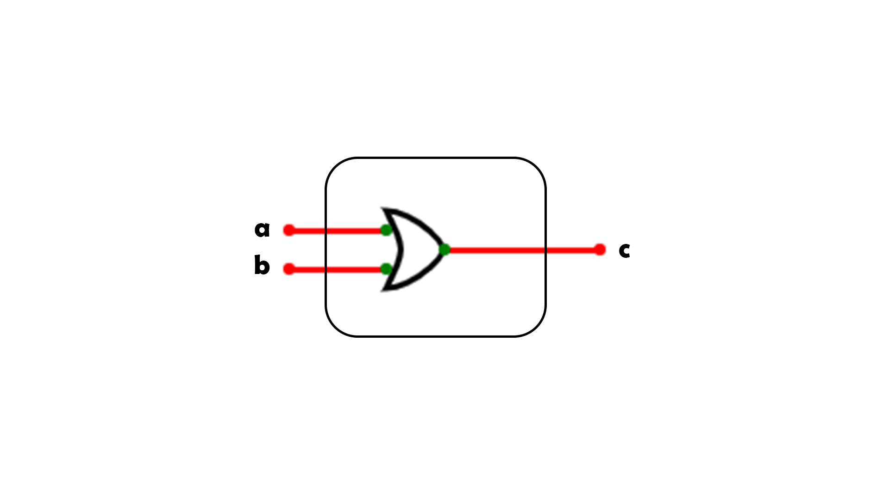

# __Introduction to VHDL__


---

__Mohamed Salem Mohamed__

Drive: https://drive.google.com/drive/folders/19KyYJOgZSFlZfGzc6FWgkRxtoCVd9kQp?usp=sharing

---
### Lecture 1
---

### __Let's carry on our tutorial and implement the basic gates using VHDL.__

---

### __1- NOT gate__


We will start off just by using our libraries

```vhdl
library ieee;
use ieee.std_logic_1164.all;
```

Then we will define our not_gate entity
```vhdl
entity not_gate is
```

and define the ports of the entity
```vhdl
    port (
        a: in std_logic;
        r: out std_logic
    );
```
End our entity
```vhdl
end entity not_gate;
```

Define our architecture of not_gate
```vhdl
architecture not_gate_arch of not_gate is
```

Begin our architecture and utilize it
```vhdl
begin
    r <= not a;
```

End the architecture
```vhdl
end architecture not_gate_arch;
```

---

Now let's implement the AND gate

### __2- AND gate__


```vhdl
ibrary ieee;
use ieee.std_logic_1164.all;

entity and_gate is
```

Everything is the same till the ports definition

```vhdl
    port (
        a: in std_logic;
        b: in std_logic;
    );
```

End entity
```vhdl
end entity and_gate
```

The architecture is the same, except replacing utilization
```vhdl
architecture and_gate_arch of and_gate is
begin
    c <= a and b;
end architecture and_gate_arch;
```
---
Everything goes the same for the OR gate only replacing the utilization

### __3- OR gate__



```vhdl
library ieee;
use ieee.std_logic_1164.all;

entity or_gate is
    port (
        a: in std_logic;
        b: in std_logic;
        c: out std_logic
    );
end entity or_gate;

architecture or_gate_arch of or_gate is
begin
    c <= a or b;
end architecture or_gate_arch;
```

---
### __4- XOR gate__

```vhdl
library ieee;
use ieee.std_logic_1164.all;

entity xor_gate is
    port (
        a: in std_logic;
        b: in std_logic;
        c: out std_logic
    );
end entity xor_gate;

architecture xor_gate_arch of xor_gate is
begin
    c <= a xor b;
end architecture xor_gate_arch;
```

---
__Next lesson we will discuss test benches and how to see wave form of our circuit.__